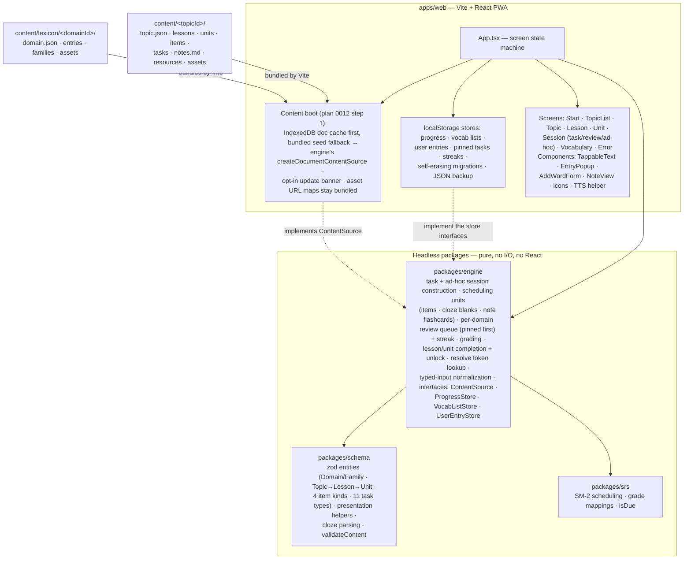
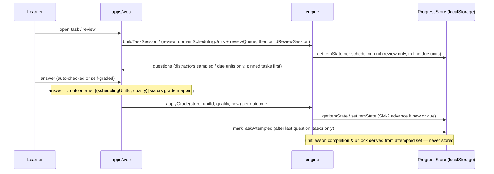
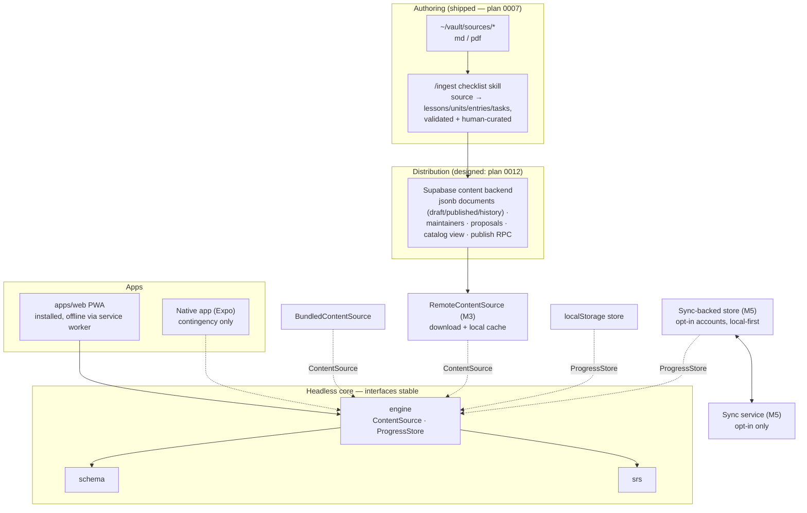

# Architecture

Status: living document · Created 2026-07-06 · Last updated 2026-07-19 (reflects plans 0001–0011 as shipped, plan 0012 steps 1–2 as shipped, step 3 as [specs](specs/)) · Normative sources: the [plans](plans/); requirements and decision index: [design.md](design.md)

## Invariants (hold across all milestones)

1. **Headless core** — all domain logic in platform-agnostic packages; apps are thin views. No logic in an app that a second app would need.
2. **Content behind `ContentSource`** — apps obtain topics only through this interface; the schema is the contract regardless of transport.
3. **Offline-first** — fully functional without network; network only for topic download and opt-in sync (later milestones).
4. **Privacy by default** — learner data stays on the device unless the user opts into sync. No telemetry.

## Current architecture (after plans 0001–0009)

A pnpm TypeScript monorepo: three headless packages (pure, no I/O, no React), one Vite + React PWA, and hand-curated content as JSON/markdown in the repo — per-domain lexicons plus per-topic lesson trees.

Key mechanics:

- `packages/schema` owns the topic-generic domain model: **Domains** with a canonical lexicon (entries, families, one-side-authored symmetric links) and **Topic → Lesson → Unit** trees whose units own items/tasks/notes (plan 0008). Item payloads are discriminated by `kind` (`lexeme`, `concept`, `sentence` with cloze markup, `pair`); presentation helpers define what is shown vs. asked per kind; `validateContent` enforces the lettered rule classes accumulated across plans 0001/0002/0004/0006/0008. Nothing language-specific exists outside payloads.
- `packages/srs` is pure SM-2 exactly as pinned in plan 0001: state type, scheduling function, the answer→quality grade mappings (`recognizeQuality`/`recallQuality`), and `isDue`. Unchanged since milestone 1 — every later feature reuses it as-is.
- `packages/engine` holds all remaining app-independent behavior: session construction for the 11 task types plus ad-hoc vocabulary sessions with runtime mode floors (plan 0004), **scheduling units** (per item, per cloze blank, per note flashcard), the per-domain review queue (deduplicated across topics, pinned tasks first) and streak, grade application (due/practice-only rule), derived lesson/unit completion and unlock gating, `resolveToken` tap-lookup (exact-then-prefix), and typed-input normalization. It pins the four async interfaces the web app's adapters implement.
- `apps/web` contains only view code plus adapters. Content boots cache-first (plan 0012 step 1): cached backend documents from IndexedDB win, the bundled content — now assembled as seed documents — is the fallback; both paths validate through the engine's `createDocumentContentSource` (per-topic `validateContent` + cross-set `validateContentSet`), and the app renders a developer-facing error screen on seed failure while a broken cache self-heals to the seed. Content updates are strictly opt-in via a home-screen banner (all-or-nothing validated accept). Note markdown now lives inside topic documents; asset URLs stay bundled and frozen.
- **Authoring** (plan 0012 step 2): a home-screen entry (only when the backend is configured) leads to magic-link sign-in and a form-based editor over the author's documents — topic structure and domain lexicons, editing the raw `draft` with autosave; deletes go through engine edit ops (`documentEdit.ts`) that strip every id reference; publish runs the full client-side set validation, then the atomic `publish_document` RPC (optimistic version check). A document stamped with a newer `CONTENT_SCHEMA_VERSION` renders read-only. The `@supabase/supabase-js` client lives behind `apps/web/src/backend/`; learners' only network path remains the anonymous catalog GET. All learner state — per-scheduling-unit SM-2 records, attempted tasks, per-domain streaks, vocab lists, learner-created entries, pinned tasks — lives in `localStorage` behind the store interfaces, with presence-based self-erasing migrations and JSON export/import backup (plan 0006). Read-aloud uses recorded assets first, else on-device TTS restricted to local voices (offline-first).
- Layering rule (mechanical, from plan 0001): every exported function in `apps/web` either renders React or adapts a browser API; any pure function over core types belongs in `packages/engine`.

Deployment: every push to `main` builds and deploys the web app to GitHub Pages (`.github/workflows/deploy.yml`; `BASE_PATH=/BetterBeaver/` feeds Vite's `base`). The PWA precaches the app shell, content, fonts, and media for offline use.

A task session, end to end (review and ad-hoc sessions differ only in how questions are sourced — due scheduling units of a domain, or a learner-chosen item set):

## Target architecture (roadmap end state)

What the milestones add. The pinned interfaces and the four invariants stay fixed; the core packages grow only by union extension (new item kinds, new task types).

Milestone scope, order, and rationale live in [plan 0001's roadmap](plans/0001-content-schema-and-kyrgyz-slice.md#roadmap-later-milestones--order-decided-at-each-retro) (order decided at each retro) — not duplicated here. M2 landed as plan 0007: `/ingest` is a human-in-the-loop checklist skill, not an automated pipeline. **M3's open question ("DB or static packs") is now decided by [plan 0012](plans/0012-content-backend-and-editing.md)**: a Supabase backend storing whole JSON documents, with in-app editing (per-document maintainers, drafts, atomic publish, proposals) on top — a scope beyond the original M3 because editing, not just distribution, became the requirement; accounts arrive for authors only (an explicit amendment of the M5 "accounts are opt-in, later" decision — learners stay account-free). Plan 0012 §9 also pins the M5 progress-sync design (local-first `SyncedProgressStore`, merge rules) without scheduling it. Architecturally, each remaining milestone is still one of only three kinds of change: a new implementation of a pinned interface (`RemoteContentSource`, sync-backed `ProgressStore`), a union extension in the core (M4 item kinds and task types), or something entirely outside the app (the Supabase backend, the sync service).

The target diagram is a direction, not a commitment: each milestone's concrete design is decided when it starts, constrained only by the four invariants and the two pinned interfaces.
