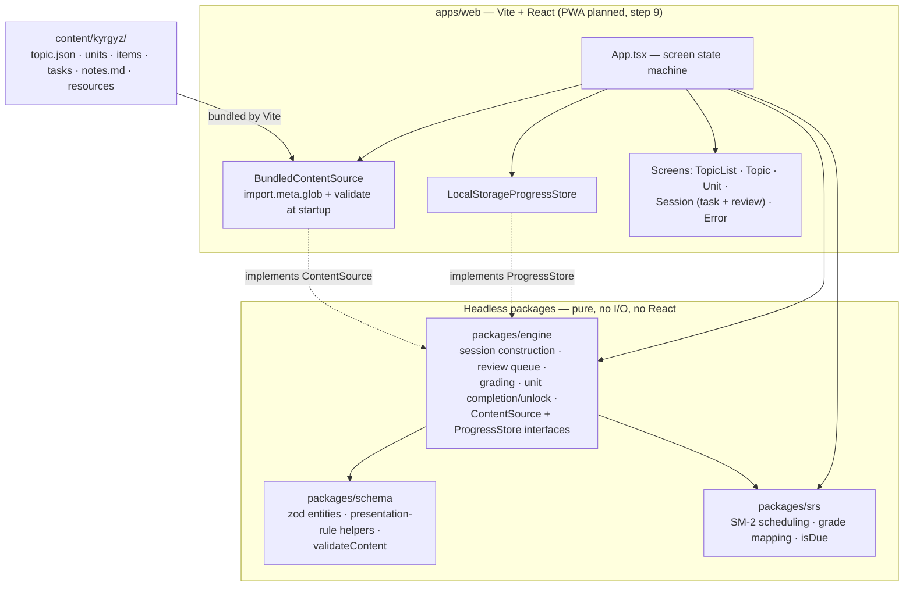
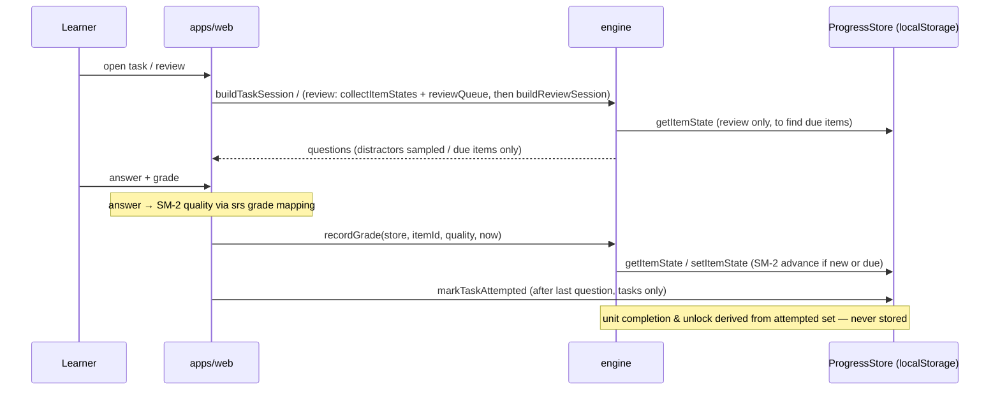
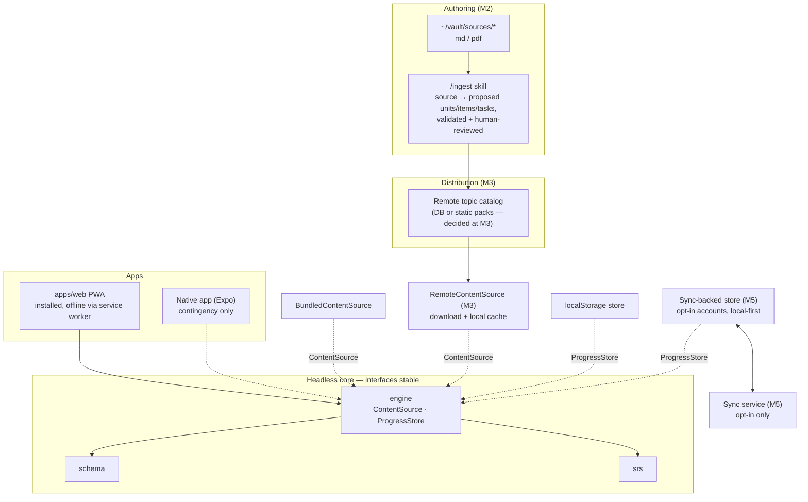

# Architecture

Status: living document · Created 2026-07-06 (milestone 1, after step 7 work) · Normative source for milestone 1 details: [plan 0001](plans/0001-content-schema-and-kyrgyz-slice.md)

## Invariants (hold across all milestones)

1. **Headless core** — all domain logic in platform-agnostic packages; apps are thin views. No logic in an app that a second app would need.
2. **Content behind `ContentSource`** — apps obtain topics only through this interface; the schema is the contract regardless of transport.
3. **Offline-first** — fully functional without network; network only for topic download and opt-in sync (later milestones).
4. **Privacy by default** — learner data stays on the device unless the user opts into sync. No telemetry.

## Current architecture (milestone 1)

A pnpm TypeScript monorepo: three headless packages (pure, no I/O, no React), one Vite + React web app, and hand-authored content as JSON/markdown in the repo.

Key mechanics:

- `packages/schema` owns the topic-generic domain model (Topic → Units → Items/Tasks/Notes, typed item payloads discriminated by `kind`), the presentation-rule helpers (what is shown vs. asked per kind — `recognizePrompt`, `recallPrompt`, `recallReveal`, …), and `validateContent`, which enforces the referential-integrity rules from plan 0001. Nothing language-specific exists outside item payloads.
- `packages/srs` is pure SM-2: state type, scheduling function, the answer→quality grade mappings (`recognizeQuality`/`recallQuality`), and `isDue`. The web app calls the grade mappings directly when the learner answers.
- `packages/engine` holds all remaining app-independent behavior: session construction composing schema's presentation rules, recognize-distractor sampling via injected RNG, review-queue assembly, grade application (due/practice-only rule), derived unit completion and unlock gating. It also pins the two async interfaces the web app's adapters implement (one each).
- `apps/web` contains only view code plus the two adapters. `BundledContentSource` validates at startup and the app renders a developer-facing error screen on failure; learner progress (per-item SM-2 state, attempted-task set) lives in `localStorage`.
- Layering rule (mechanical, from plan 0001): every exported function in `apps/web` either renders React or adapts a browser API; any pure function over core types belongs in `packages/engine`.

A study session, end to end:

## Target architecture (roadmap end state)

What the milestones add. The pinned interfaces and the four invariants stay fixed; the core packages grow only by union extension (new item kinds, new task types).

Milestone scope, order, and rationale live in [plan 0001's roadmap](plans/0001-content-schema-and-kyrgyz-slice.md#roadmap-later-milestones--order-decided-at-each-retro) (order decided at each retro) — not duplicated here. Architecturally, each milestone is one of only three kinds of change: a new implementation of a pinned interface (M3 `RemoteContentSource`, M5 sync-backed `ProgressStore`), a union extension in the core (M4 item kinds and task types), or something entirely outside the app (M2 `/ingest` authoring pipeline, M3 catalog, M5 sync service).

The target diagram is a direction, not a commitment: each milestone's concrete design is decided when it starts, constrained only by the four invariants and the two pinned interfaces.
